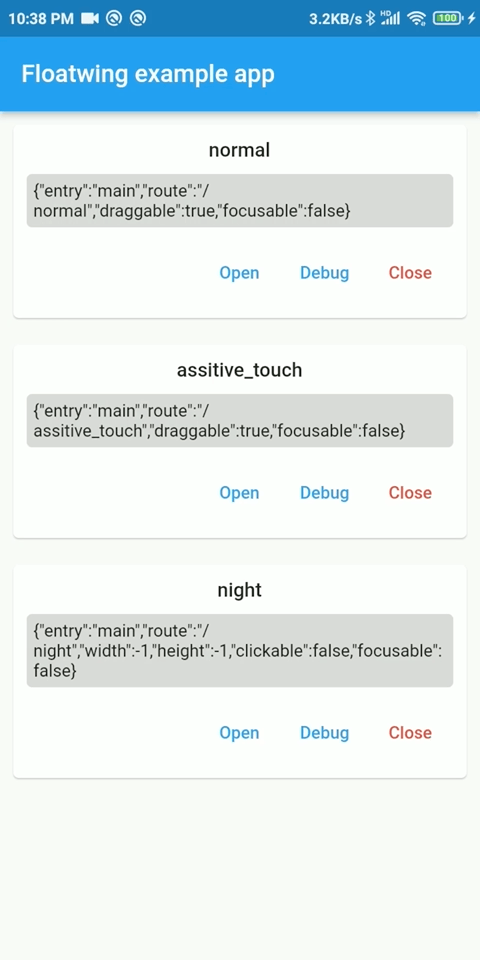
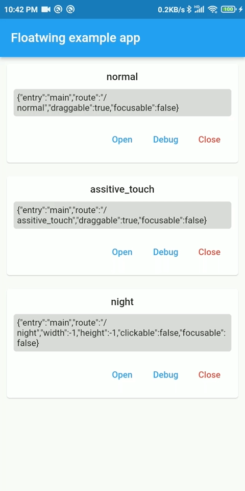
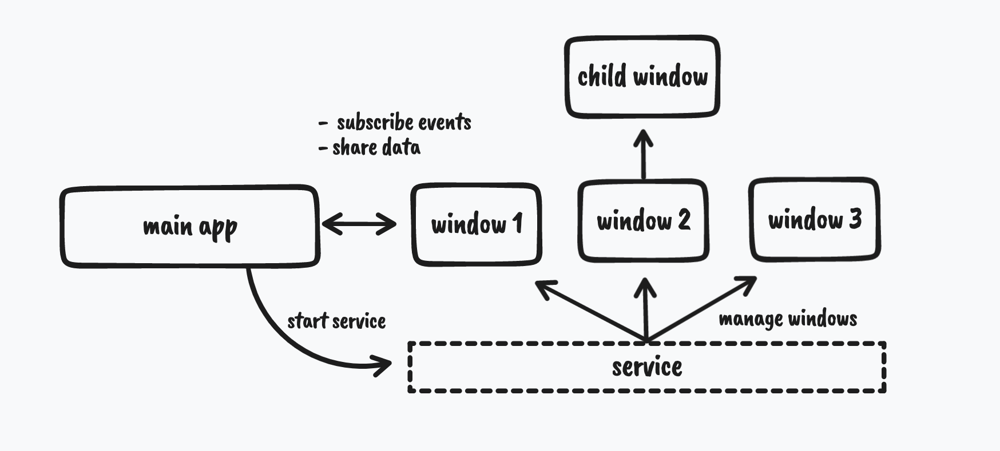

<div align="center">

# flutter_floatwing

**Create beautiful floating overlay windows on Android with pure Flutter**

[](https://pub.dev/packages/flutter_floatwing)
[](LICENSE)
[](https://flutter.dev)

<br/>


&nbsp;&nbsp;&nbsp;&nbsp;

&nbsp;&nbsp;&nbsp;&nbsp;


</div>

<br/>

## ✨ Features

| Feature | Description |
|---------|-------------|
| 🎨 **Pure Flutter** | Write overlay windows entirely in Flutter — no native code needed |
| 🚀 **Simple API** | Start an overlay window with just 1 line of code |
| 📐 **Auto Resize** | Window automatically resizes to fit your Flutter widget |
| 🪟 **Multi-window** | Create multiple overlay windows with parent-child relationships |
| 💬 **Communication** | Share data between main app and overlay windows seamlessly |
| 📡 **Event System** | Subscribe to window lifecycle and drag events |

<br/>

## 📦 Installation

Add to your `pubspec.yaml`:

```yaml
dependencies:
  flutter_floatwing: ^0.2.1
```

Or run:

```bash
flutter pub add flutter_floatwing
```

<br/>

## 🚀 Quick Start

### 1. Add Permission

In `AndroidManifest.xml`:

```xml
<uses-permission android:name="android.permission.SYSTEM_ALERT_WINDOW" />
```

### 2. Setup Routes

```dart
MaterialApp(
  routes: {
    "/": (_) => HomePage(),
    "/overlay": (_) => MyOverlayWidget(),  // Your overlay window
  },
);
```

### 3. Initialize & Request Permission

```dart
// Check and request permission
FloatwingPlugin().checkPermission().then((granted) {
  if (!granted) FloatwingPlugin().openPermissionSetting();
});

// Initialize plugin
FloatwingPlugin().initialize();
```

### 4. Launch Overlay Window

```dart
// That's it! One line to start your overlay
WindowConfig(route: "/overlay").to().create(start: true);
```

<br/>

## 📖 Usage Guide

### Window Configuration

```dart
// Basic window
WindowConfig(route: "/overlay").to().create(start: true);

// With custom ID and event handlers
WindowConfig(id: "my-window", route: "/overlay")
    .to()
    .on(EventType.WindowCreated, (window, _) => print("Created!"))
    .on(EventType.WindowDestroy, (window, _) => print("Destroyed!"))
    .create(start: true);
```

### Three Ways to Define Entry Points

| Method | Config | Use Case |
|--------|--------|----------|
| **Route** | `WindowConfig(route: "/overlay")` | Simplest — use your existing routes |
| **Callback** | `WindowConfig(callback: myMain)` | Direct function reference |
| **Entry Point** | `WindowConfig(entry: "myMain")` | String-based, requires `@pragma` |

<details>
<summary><b>Entry Point Example</b></summary>

```dart
@pragma("vm:entry-point")
void myOverlayMain() {
  runApp(MyOverlayWidget().floatwing(app: true));
}

// Then use:
WindowConfig(entry: "myOverlayMain").to().create(start: true);
```

</details>

### Access Window in Overlay

```dart
class _MyOverlayState extends State<MyOverlay> {
  @override
  void initState() {
    super.initState();
    SchedulerBinding.instance?.addPostFrameCallback((_) {
      final window = Window.of(context);
      print("Window ID: ${window?.id}");
    });
  }
}
```

### Share Data Between Windows

**Send data from main app:**

```dart
window.share({"message": "Hello!"}).then((response) {
  print("Window responded: $response");
});
```

**Receive data in overlay:**

```dart
window?.onData((source, name, data) async {
  print("Received from $source: $data");
  return "Got it!";  // Optional response
});
```

### Subscribe to Events

```dart
window?.on(EventType.WindowStarted, (w, _) {
  print("Window started");
}).on(EventType.WindowDragEnd, (w, position) {
  print("Dragged to: $position");
});
```

**Available Events:**

| Lifecycle | Actions |
|-----------|---------|
| `WindowCreated` | `WindowDragStart` |
| `WindowStarted` | `WindowDragging` |
| `WindowPaused` | `WindowDragEnd` |
| `WindowResumed` | |
| `WindowDestroy` | |

<br/>

## 🏗️ Architecture

<details>
<summary><b>How it works</b></summary>

<br/>

Each floating window consists of:
- A **Flutter Engine** running your widget via `runApp`
- An **Android View** attached to the Window Manager


<br/>

**Key Concepts:**

- **Main Engine**: The Flutter engine from your main app
- **Window Engine**: Separate engines for each overlay window
- Engines run in **different threads** and communicate via `share()`
- **Window ID** is required and unique for each window

<br/>



</details>

<br/>

## 📚 API Reference

### FloatwingPlugin

```dart
FloatwingPlugin()
  ..checkPermission()       // Check overlay permission
  ..openPermissionSetting() // Open system settings
  ..initialize()            // Initialize the plugin
  ..currentWindow           // Get current window (in overlay)
  ..windows                 // Map of all windows by ID
```

### WindowConfig

```dart
WindowConfig(
  id: "unique-id",          // Window identifier
  route: "/overlay",        // Route-based entry
  callback: myFunction,     // Function-based entry  
  entry: "functionName",    // String-based entry
)
```

### Window

```dart
window
  ..create(start: true)     // Create and optionally start
  ..start()                 // Start the window
  ..close()                 // Close the window
  ..share(data)             // Send data to window
  ..on(event, handler)      // Subscribe to events
  ..onData(handler)         // Handle incoming data
```

<br/>

## 🤝 Contributing

Contributions are welcome! Feel free to:

- Report bugs or request features via [Issues](https://github.com/jiusanzhou/flutter_floatwing/issues)
- Submit pull requests
- Improve documentation

<br/>

## 📄 License

```
Apache License 2.0
Copyright (c) 2022 Zoe
```

<br/>

<div align="center">

**[⬆ Back to Top](#flutter_floatwing)**

</div>
